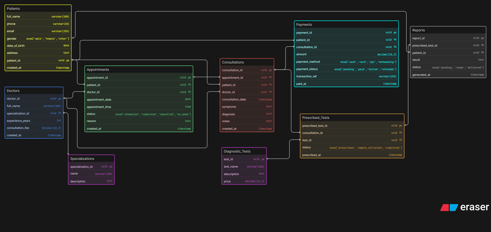

# Clinic Appointment & Diagnostics System - ER Diagram

## 🚀 Project Overview

This project represents a database design for a modern clinic system that manages appointments, consultations, diagnostic tests, reports, and payments.

---

## 🧠 Business Understanding

This is a clinic-level system focused on real workflow:

* Patients book appointments with doctors
* Appointments may or may not lead to consultations
* During consultation, doctors prescribe diagnostic tests
* Tests generate reports later
* Payments are linked to consultations

---

## 🏗️ Core Entities

* Patients
* Doctors
* Specializations
* Appointments
* Consultations (Visits)
* Diagnostic Tests (Catalog)
* Prescribed Tests
* Reports
* Payments

---

## 🔗 Key Relationships

* One patient → many appointments
* One doctor → many patients
* One appointment → optional consultation
* One consultation → multiple tests
* One test → reused across consultations
* One prescribed test → one report

---

## 💡 Key Design Decisions

* **Appointment vs Consultation separated** → real-world accuracy
* **Test Catalog separated** → avoids duplication
* **Prescribed Tests as junction table** → handles many-to-many
* **Reports linked to prescribed tests** → correct workflow
* **Payments linked to consultation** → billing clarity

---

## 🎨 ER Diagram

  

---

## 🛠️ Tools Used

* Eraser
* GitHub

---

## 📂 Files Included

* ER Diagram Image
* ER Diagram Code

---

## 👨‍💻 Author

Rochak Tiwari
